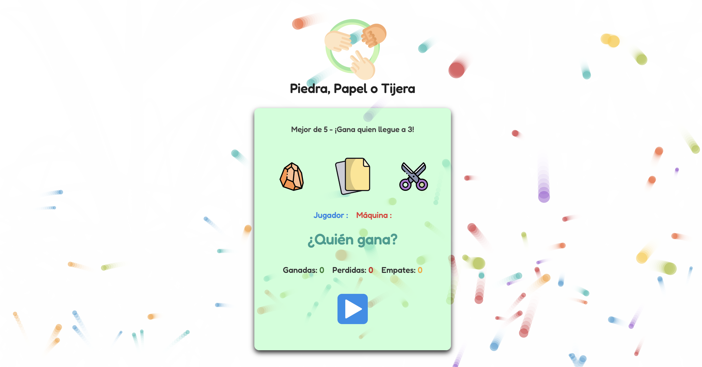

#  Piedra, Papel o Tijera ✌

Pequeño juego interactivo hecho con **HTML, CSS y JavaScript**, utilizando animaciones ligeras de elementos con **Anime.js** y **tsParticles** con el **preset "fountain"** para animaciones de partículas.

## Funcionalidades

- Elección aleatoria de la máquina
- Contador de partidas ganadas y perdidas
- Resultados dinámicos visuales
- Animaciones de partículas en los resultados

## 🎮 Captura de pantalla

## 🛠️ Tecnologías usadas

- **HTML5**
- **CSS**
- **JavaScript**
- **[Anime.js](https://animejs.com/)** – Animaciones ligeras de elementos (botones, resultados, etc.)
- **[tsParticles + Fountain Preset](https://github.com/tsparticles/preset-fountain)** – Animaciones de partículas para efectos visuales dinámicos
